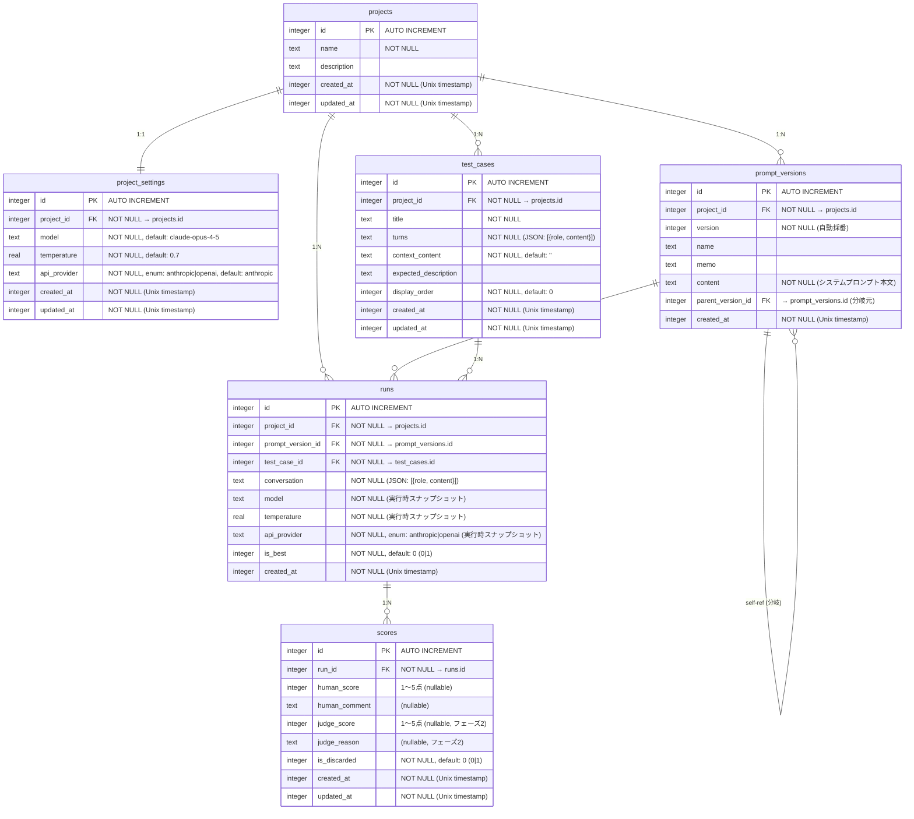

# ER図

prompt-reviewer のデータベーススキーマ（Drizzle ORM / SQLite）

## テーブル関連図

## テーブル説明

### projects
システムプロンプト改善の作業単位。プロジェクトは複数のテストケースとプロンプトバージョンを持つ。

### project_settings
プロジェクトごとのLLM設定（モデル・temperature・APIプロバイダー）。プロジェクトと1:1で紐づく。  
**APIキーは別管理**（セキュリティ上、DBには保存しない）。

### test_cases
システムプロンプトを評価するためのマルチターン入力ケース。
- `title`: テストケースの名前
- `turns`: `[{role: "user"|"assistant", content: string}]` 形式のJSON文字列
- `context_content`: `{{context}}` プレースホルダーに挿入するテキスト（単一のテキストブロック）
- `expected_description`: 期待する出力の自由記述（任意）
- `display_order`: 一覧表示時の並び順（デフォルト0）

### prompt_versions
システムプロンプトのバージョン履歴。
- `version`: プロジェクト内で自動採番
- `parent_version_id`: 分岐元バージョンのID（ツリー構造で管理）
- 破棄しない限り全バージョンを保持

### runs
プロンプトバージョン × テストケースの実行結果。同一の組み合わせで複数回保持可能。
- `project_id`: 所属プロジェクト（外部キー）
- `conversation`: 実行時の全会話履歴（JSON）
- `model` / `temperature` / `api_provider`: 実行時の `project_settings` をスナップショット保存。設定変更後も過去の実行条件を正確に参照できる
- `is_best`: バージョン×ケースごとのベスト回答フラグ（0|1）
- `is_discarded`: Run の破棄フラグ。既定の一覧では除外し、必要時のみ表示する（0|1）

### scores
Run に対する評価スコアを管理する。1つの Run に対して複数のスコアを保持可能（再採点・LLM Judge追加を想定）。
- `human_score`: 人間が付けた1〜5点のスコア（NULL=未採点）
- `human_comment`: 人間によるフリーテキストコメント（任意）
- `judge_score`: LLM Judge が付けた1〜5点のスコア（フェーズ2実装、フェーズ1はNULL）
- `judge_reason`: LLM Judge の評価理由（フェーズ2実装、フェーズ1はNULL）
- `is_discarded`: 廃棄フラグ。不正データや再実行後に無効化したスコアに使用（0|1）
