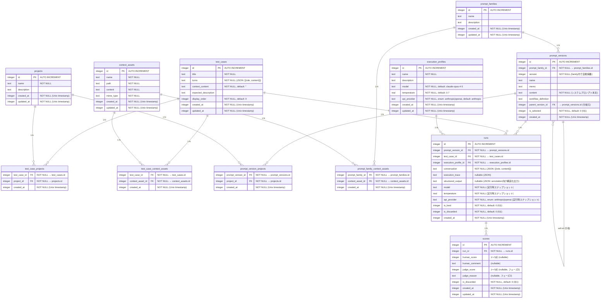

# ER図

prompt-reviewer のデータベーススキーマ案（Drizzle ORM / SQLite）

## 設計方針

- `test_cases` と `prompt_versions` は `project` から独立したグローバル資産として扱う
- `context_assets` も独立したグローバル資産として扱う
- `projects` は所有単位ではなく、後から付与できる分類ラベルとして扱う
- `project_settings` は廃止し、実行条件は `execution_profiles` として独立管理する
- `未分類` は実テーブルのレコードではなく、「ラベルが1件も付いていない状態」を指す
- annotation 機能のドメイン仕様は `doc/annotation-feature-spec.md` で別管理し、この ER 図にはまだ反映していない

## テーブル関連図



## テーブル説明

### projects
分類用のラベル。`test_cases` や `prompt_versions` の所有者ではなく、後から複数付与できる。

- 通常のプロジェクトと `未分類` は区別する
- `未分類` は `projects` の実レコードではなく、中間テーブルに紐付けがない状態として表現する

### test_cases
システムプロンプトを評価するためのマルチターン入力ケース。単独で存在でき、どの `project` にも属さない状態を許容する。

- `title`: テストケースの名前
- `turns`: `[{role: "user"|"assistant", content: string}]` 形式の JSON 文字列
- `context_content`: `{{context}}` プレースホルダーに挿入するテキスト
- `expected_description`: 期待する出力の自由記述
- `display_order`: 一覧表示上の並び順。グローバルな既定順として保持する

### context_assets
コンテキスト素材の実体。テストケースやプロンプト系統に取り込む前の再利用可能なテキスト資産として扱う。

- `name`: UI 上の表示名
- `path`: 元ファイル名や論理パス。現行のファイル選択 UI を引き継ぐために保持する
- `content`: 素材本文
- `mime_type`: テキスト種別
- どの `project` にも属さない状態を許容する

### prompt_families
同一系統のプロンプト群を束ねるための親概念。

- 「全く別のプロンプト」を誤って同じ履歴系列に積まないための単位
- `prompt_versions.version` の採番スコープを持つ
- 必須ではないが、プロンプト履歴を安定して扱うために導入する

### prompt_versions
システムプロンプトのバージョン履歴。`project` には直接所属せず、`prompt_family` に属する。

- `version`: `prompt_family` 内で自動採番
- `parent_version_id`: 分岐元バージョン
- `workflow_definition`: 将来のステップ実行定義
- `is_selected`: UI 上で現在選択中の候補を示すフラグ

### test_case_projects
`test_cases` と `projects` の多対多を表す中間テーブル。

- 1つのテストケースに複数ラベルを付与できる
- ラベルが0件なら未分類として扱う
- 重複付与を防ぐため、実装時は `UNIQUE(test_case_id, project_id)` を付ける前提

### test_case_context_assets
`test_cases` と `context_assets` の多対多を表す中間テーブル。

- 1つのテストケースに複数の素材を関連付けできる
- 1つの素材を複数のテストケースで使い回せる
- 取り込み後の最終テキストは引き続き `test_cases.context_content` に保存する
- 実装時は `UNIQUE(test_case_id, context_asset_id)` を付ける前提

### prompt_version_projects
`prompt_versions` と `projects` の多対多を表す中間テーブル。

- 1つのプロンプトバージョンに複数ラベルを付与できる
- ラベルが0件でも保存できる
- 実装時は `UNIQUE(prompt_version_id, project_id)` を付ける前提

### prompt_family_context_assets
`prompt_families` と `context_assets` の多対多を表す中間テーブル。

- プロンプト系統ごとの設計資料、ルール集、評価メモを関連付けできる
- `prompt_version` ではなく `prompt_family` に付けることで、系列全体で共有しやすくする
- 実装時は `UNIQUE(prompt_family_id, context_asset_id)` を付ける前提

### execution_profiles
Run 実行時に参照する実行条件テンプレート。旧 `project_settings` を置き換える。

- `model` / `temperature` / `api_provider` を保持する
- `project` から独立しており、同じ設定を複数のテストケースやプロンプトで再利用できる
- API キーのような秘匿情報は引き続き別管理

### runs
`prompt_version` × `test_case` × `execution_profile` の実行結果。

- `project_id` は持たない
- 一覧上で project ごとに絞り込む場合は、`prompt_version_projects` を基準に判定する
- `model` / `temperature` / `api_provider` は `execution_profile` 参照時の値をスナップショット保存する
- `is_best`: バージョン×ケースごとのベスト回答フラグ
- `is_discarded`: Run の破棄フラグ
- `structured_output`: annotation 向け構造化 JSON 出力（nullable）。`{ "items": [{label, start_line, end_line, quote, rationale}] }` 形式。存在しない場合は `conversation` の最終 assistant メッセージをフォールバックとして使う

### scores
Run に対する評価スコアを管理する。1つの Run に対して複数のスコアを保持可能。

- `human_score`: 人間が付けた 1〜5 点のスコア
- `human_comment`: 人間によるフリーテキストコメント
- `judge_score`: LLM Judge が付けた 1〜5 点のスコア
- `judge_reason`: LLM Judge の評価理由
- `is_discarded`: 無効化したスコアを表すフラグ

## 補足

### project をラベル扱いにした理由

- テストケースとプロンプトを先に作り、あとから分類できる
- 同一資産を複数の文脈で再利用できる
- `default project` を作らずに `未分類` を自然に表現できる

### context_assets を独立させた理由

- 素材置き場として再利用しやすい
- テストケース専用素材とプロンプト系統の参考資料を同じ枠組みで扱える
- 取り込み前の素材と、実行時に使う `context_content` の責務を分離できる

### 今後の実装上の論点

- `context-files` のファイルシステム保存を続けるか、`context_assets.content` に DB 保存へ寄せるか決める必要がある
- API は `/projects/:projectId/...` 前提なので、資産中心の URL に再設計が必要
- `runs` の project 絞り込みはプロンプト側ラベル基準で API に明記する必要がある

## context_assets 保存方式の比較

### 案1: ファイルシステム主体

概要:
`context_assets` テーブルにはメタデータだけを持ち、本文は `data/context-assets/<asset-id>` のようなファイルとして保存する。

想定カラム:
- `id`
- `name`
- `path`
- `mime_type`
- `storage_key`
- `size`
- `content_hash`
- `created_at`
- `updated_at`

長所:
- 既存の `context-files` 実装に近く、移行コストが低い
- 大きめのテキストでも DB を膨らませにくい
- 将来バイナリ添付を扱いたくなった時に拡張しやすい

短所:
- DB とファイルの整合性管理が必要になる
- バックアップ、コピー、削除が二相管理になる
- Cloudflare Workers のような「ローカル FS 前提でない環境」と相性が悪い
- トランザクション境界が分かれるため、更新失敗時の後始末が増える

向いている場合:
- ローカル利用が中心
- 既存実装を活かして早く移行したい
- ファイルとしての入出力を今後も重視する

### 案2: DB 主体

概要:
`context_assets.content` に本文をそのまま保存し、必要なら `path` は論理名として保持する。

想定カラム:
- `id`
- `name`
- `path`
- `content`
- `mime_type`
- `content_hash`
- `created_at`
- `updated_at`

長所:
- 整合性が高い。作成・更新・削除を 1 トランザクションで扱いやすい
- SQLite / PostgreSQL / D1 など環境差を吸収しやすい
- バックアップとエクスポートが単純になる
- 現在の用途が「テキストを選んで取り込む」中心なので責務に合っている

短所:
- 非常に大きいテキストを大量保存すると DB サイズが増えやすい
- OS 上のファイルとして直接触るワークフローには向かない
- 将来バイナリ管理まで広げるなら別設計が必要

向いている場合:
- テキスト資産が中心
- 複数実行環境に持っていきたい
- アプリ全体を DB 中心で一貫させたい

### 推奨

第一候補は DB 主体。

理由:
- 現在の `context-files` は実質的に「テキスト素材ライブラリ」であり、汎用ファイルストレージではない
- このプロダクトは SQLite を中心にしつつ他 DB へ持っていく前提なので、ファイルシステム依存を減らしたほうが将来の移植性が高い
- `test_cases.context_content` に取り込むという現行 UX とも整合する

例外:
- ローカル専用ツールとして割り切り、Markdown やテキストを外部エディタで直接編集したい要求が強いなら、短期的にはファイルシステム主体もあり

### 推奨移行方針

1. まずは `context_assets` を DB 主体で追加する
2. 現行の `context-files` API は互換レイヤとして残し、裏側では `context_assets` を読む
3. UI の `コンテキスト管理` を `project` 基準から独立資産基準へ移す
4. 安定後に `/projects/:projectId/context-files` を段階的に廃止する

## API 再設計案

### 基本方針

- 親子 URL ではなく、資産中心の URL にする
- `project` は所有者ではなくフィルタ条件として扱う
- `runs` 一覧の `project_id` フィルタはプロンプト側ラベル基準にする

### context_assets API

一覧取得:
`GET /api/context-assets`

クエリ例:
- `project_id=3`
- `unclassified=true`
- `linked_to=test_case:12`
- `linked_to=prompt_family:4`
- `q=refund`

レスポンス例:

```json
[
  {
    "id": 10,
    "name": "refund-policy.md",
    "path": "policies/refund-policy.md",
    "mime_type": "text/markdown",
    "updated_at": 1744281600000
  }
]
```

詳細取得:
`GET /api/context-assets/:id`

作成:
`POST /api/context-assets`

```json
{
  "name": "refund-policy.md",
  "path": "policies/refund-policy.md",
  "content": "購入から30日以内であれば返金可能です。",
  "mime_type": "text/markdown"
}
```

更新:
`PATCH /api/context-assets/:id`

```json
{
  "name": "refund-policy-v2.md",
  "content": "購入から45日以内であれば返金可能です。"
}
```

削除:
`DELETE /api/context-assets/:id`

### context_assets 関連付け API

テストケースへ関連付け:
`PUT /api/test-cases/:id/context-assets`

```json
{
  "context_asset_ids": [10, 12, 18]
}
```

プロンプト系統へ関連付け:
`PUT /api/prompt-families/:id/context-assets`

```json
{
  "context_asset_ids": [4, 7]
}
```

補足:
- まずは全置換 `PUT` にすると実装が単純
- 差分更新が必要になったら `POST` / `DELETE` を個別追加する

### test_cases API

一覧:
`GET /api/test-cases`

クエリ例:
- `project_id=3`
- `unclassified=true`

詳細:
`GET /api/test-cases/:id`

作成:
`POST /api/test-cases`

```json
{
  "title": "返金手続きの問い合わせ",
  "turns": [
    { "role": "user", "content": "返金の手続きを教えてください" }
  ],
  "context_content": "【返金ポリシー】購入から30日以内であれば返金可能です。",
  "expected_description": "丁寧に返金手続きを案内すること"
}
```

更新:
`PATCH /api/test-cases/:id`

### prompt_families / prompt_versions API

プロンプト系統一覧:
`GET /api/prompt-families`

プロンプト版一覧:
`GET /api/prompt-versions?prompt_family_id=4`

プロンプト版作成:
`POST /api/prompt-versions`

```json
{
  "prompt_family_id": 4,
  "content": "あなたは返金問い合わせ対応ボットです。",
  "name": "返金対応 v3",
  "memo": "確認質問を先に入れる"
}
```

### projects ラベル API

一覧:
`GET /api/projects`

資産へのラベル付け:
- `PUT /api/test-cases/:id/projects`
- `PUT /api/prompt-versions/:id/projects`

例:

```json
{
  "project_ids": [1, 5]
}
```

### runs API

一覧:
`GET /api/runs`

クエリ例:
- `prompt_version_id=10`
- `test_case_id=5`
- `execution_profile_id=2`
- `project_id=3`

`project_id` の意味:
- `prompt_version_projects` にそのラベルが付いた `prompt_version` の Run のみ返す
- `test_case_projects` は `runs` の project 絞り込み条件には使わない

詳細:
`GET /api/runs/:id`

作成:
`POST /api/runs`

```json
{
  "prompt_version_id": 10,
  "test_case_id": 5,
  "execution_profile_id": 2,
  "conversation": [
    { "role": "user", "content": "返金できますか？" }
  ]
}
```

実行:
`POST /api/runs/execute`

```json
{
  "prompt_version_id": 10,
  "test_case_id": 5,
  "execution_profile_id": 2,
  "api_key": "..."
}
```

### execution_profiles API

一覧:
`GET /api/execution-profiles`

作成:
`POST /api/execution-profiles`

```json
{
  "name": "Claude Sonnet 低温度",
  "model": "claude-sonnet-4-6",
  "temperature": 0.2,
  "api_provider": "anthropic"
}
```

更新:
`PATCH /api/execution-profiles/:id`

## 移行コストの見立て

### DB 主体にした場合

- ルーター: `context-files.ts` を `context-assets.ts` に置換
- UI: `ContextFilesPage` を `ContextAssetsPage` に置換
- テストケース編集: `projectId` 前提の素材取得を独立 API 呼び出しへ変更
- DB: `context_assets` と中間テーブルの追加、既存 `data/context-files` からの取り込みスクリプトが必要

評価:
- 初期移行コストは中程度
- 以後の構造はかなり安定する

### ファイルシステム主体にした場合

- ルーター: 現行コードをかなり再利用できる
- UI: API パス変更中心で済みやすい
- DB: メタデータだけ追加すればよい
- ただし、将来のマルチ環境対応時に再設計コストが残る

評価:
- 初期移行コストは低い
- 将来コストは高くなりやすい
